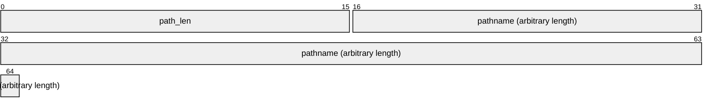

# Document Conveyance Protocol Specification V1

TLDR; ftp at home

TCP is used for transport.

TODO:
- Replies (basically just ack/nack/error status to commands)
- clarify operating states (idle, transfer in progress, processing message)
- confirmation after file is rcvd?
- error handling (illegal states, responses, what should client/server do)
- example command flow

## Terminology

- **port**
    The TCP port used for control and data transfers.
- **commands**  
    A set of commands that make up the control information transferred between the client and server.
- **command message**  
    The data structure used to encode **commands** over the transport
- **connection**  
    The communication path between a client and the server
- **file**  
    An ordered collection of data of arbitrary length identified by a pathname
- **file transfer request**  
    A type of command that initiates a file transfer operation
- **file transfer**  
    An operation consisting of a **command** from the client, a response from the server, a stream of **file** data transferred from the sender, and a response from the receiver
- **sender**  
    During a file transfer, the client or server from which the file is being sent
- **receiver**  
    During a file transfer, the client or server to which the file is being sent
- **reply**  
    A message issued in response to a **command**

## Data types

Numeric data is transmitted little endian. File data is transmitted as-is, identical to the on-disk format.

| type   | size (bytes) | description             |
|--------|--------------|-------------------------|
| uint32 | 4            | 32-bit unsigned integer |
| uint16 | 2            | 16-bit unsigned integer |
| char   | 1            | ASCII character         |

## Data Structures

### Command Messages

#### Header
All command messages shall consist of an 4 byte header, followed by N bytes of command-specific data.
```
uint8 message ID; // message identifier
byte[3] _reserved;
```


#### Command IDs
| ID | command name |
|----|--------------|
| 0  | `IDENTIFY`   |
| 1  | `GET_FILE`   |
| 2  | `PUT_FILE`   |
| 3  | `ENUMERATE`  |

#### `IDENTIFY`
Data: implementation defined arbitrary length client identifiers. 

Implementations should keep this command short.

#### `GET_FILE`

Data:
```
uint16 path_len // Length of source pathname string in bytes
char[path_len] pathname // source pathname
```


#### `PUT_FILE`

```
uint16 path_len // Length of destination pathname string in bytes
char[path_len] pathname // destination pathname
```


### File Header

```
uint16 permissions // UNIX file permissions
uint16 path_len // Length of pathname string in bytes
char[path_len] // pathname
uint64 file_size // size of file in bytes 
```


Directly following this header, the whole file contents (ie, `file_size` bytes of data) shall be sent.

## Establishing a connection

The server shall listen on the port for a connection from a client. After a successful TCP handshake, the client will... (TODO: send IDENTIFY command & verify reply)

After a connection is established, the connection will remain open until either the client or server close the connection, or an implementation defined timeout occurs.

## Initiating a file transfer

The client shall initiate a file transfer by first sending a command message indicating the type of transfer it desires (ie, either `GET_FILE` or `PUT_FILE`).

The server shall respond to the client by sending a reply message indicating whether this file transfer can proceed. If the server indicates that it cannot, the file transfer is not initiated and does not continue.

If the server indicates that the transfer may proceed, the file transfer is considered to be initiated.

After a file transfer has been initiated, the sender shall send a header containing the file metadata. (See [File Header](#file-header) above). Directly following this header the entire file contents shall be sent.
